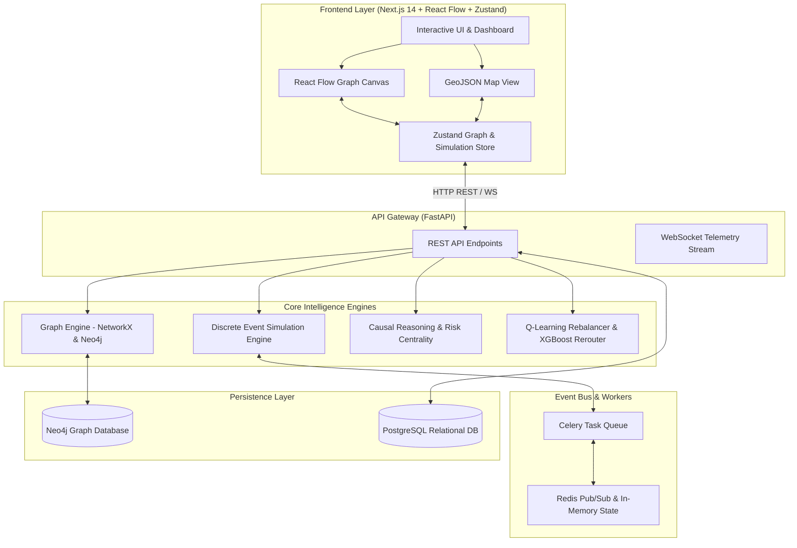

# Causally-Aware Supply Chain Digital Twin Platform

[](https://fastapi.tiangolo.com/)
[](https://nextjs.org/)
[](https://reactflow.dev/)
[](https://neo4j.com/)
[](https://redis.io/)
[](https://python.org)
[](https://www.typescriptlang.org/)

An enterprise-grade, hardware-accelerated **Supply Chain Digital Twin Platform** designed to model complex multi-echelon supply networks as dynamic interactive graphs, simulate probabilistic disruption cascades, compute causal blast radii using structural graph algorithms, optimize inventory and routing via reinforcement learning & gradient boosting, and explain AI-driven interventions in real time.

---

## 🏗️ System Architecture



---

## ✨ Key Capabilities & Features

### 1. 🌐 Dynamic Multi-Echelon Graph Modeling
- **Nodes**: Suppliers, Factories, Ports, Warehouses, Transport Hubs, and Customer Demands.
- **Node Parameters**: `capacity`, `inventory_level`, `processing_time`, `baseline_risk_score`, `delay_probability`, `geocoordinates`.
- **Edge Attributes**: `transit_time`, `cost`, `congestion_index`, `disruption_probability`, `current_flow`.
- High-performance graph traversal powered by **NetworkX** and **Neo4j Cypher** batch operations.

### 2. ⚡ Discrete Event Simulation Engine
- Time-stepped simulation ticks modeling live demand, order processing, and inventory drawdown.
- Dynamic shock injection (e.g., *Port Shutdown*, *Suez Canal Blockage*, *Factory Outage*).
- Asynchronous execution offloaded to **Celery distributed workers** with low-latency **Redis caching**.

### 3. 🎯 Structural Causal Reasoning & Risk Scoring
- Network topology risk analysis powered by **PageRank centrality scoring**.
- Dynamic blast radius calculation tracing upstream/downstream multi-hop disruption propagation.
- Real-time vulnerability indexing for critical nodes and edges.

### 4. 🤖 ML Optimization & Routing Engine
- **Tabular Q-Learning Rebalancing**: Reinforcement learning policy for real-time warehouse inventory reallocation.
- **XGBoost Rerouting**: Transit delay prediction trained on historical network metrics.
- **SHAP Explainability**: Dynamic feature attribution explaining *why* the AI recommended specific rerouting decisions.

### 5. 🖥️ Hardware-Accelerated Dual Visual Canvas
- **React Flow Canvas**: Custom node components, interactive drag/zoom, Dagre layout engine, and animated Framer Motion edges.
- **Map Canvas**: Geographic projection visualization for global supply chain routes.
- **HUD Glassmorphism Controls**: Floating telemetry panel, simulation control bar (Play/Pause/Reset), disruption injector, and SHAP explainability drawer.

---

## 🛠️ Tech Stack

### Frontend
- **Framework**: Next.js 14 (App Router, Server Actions)
- **Language**: TypeScript (Strict Mode)
- **State Management**: Zustand
- **Visualization**: React Flow, Dagre, Lucide React
- **Styling & Motion**: TailwindCSS, Framer Motion, Glassmorphism design system

### Backend
- **Framework**: Python 3.11+, FastAPI (Async/ASGI)
- **Data Validation**: Pydantic v2
- **Graph Processing**: NetworkX, Neo4j Python Async Driver
- **Machine Learning**: XGBoost, SHAP, Scikit-learn
- **Task Queue & Cache**: Celery, Redis

### Infrastructure & Persistence
- **Graph DB**: Neo4j 5
- **Relational DB**: PostgreSQL 15 (SQLAlchemy 2.0 Async)
- **Caching & Bus**: Redis 7
- **Containerization**: Docker & Docker Compose

---

## 📁 Repository Structure

```text
.
├── backend/
│   ├── app/
│   │   ├── main.py              # FastAPI application entry point & lifespan startup
│   │   ├── api/                 # API Route Handlers (Graph, Sim, Routing, Dev, Health)
│   │   ├── core/                # Configuration, logging, settings
│   │   ├── db/                  # Neo4j, PostgreSQL, and Redis client setup
│   │   ├── models/              # Database ORM models
│   │   ├── schemas/             # Pydantic request/response schemas
│   │   ├── services/            # Core business logic & ML/Simulation services
│   │   └── workers/             # Celery background workers
│   ├── tests/                   # PyTest integration & unit test suite
│   ├── Dockerfile               # Backend container configuration
│   ├── docker-compose.yml       # Full stack container orchestration
│   ├── requirements.txt         # Python dependencies
│   └── routing_model.pkl        # Pre-trained XGBoost routing delay model
├── frontend/
│   ├── src/
│   │   ├── app/                 # Next.js 14 App Router layout & page views
│   │   ├── components/
│   │   │   ├── dashboard/       # Simulation, Metrics, Routing, & Explainability panels
│   │   │   └── graph/           # React Flow canvas & Geographic map canvas
│   │   ├── lib/                 # Graph reasoning utilities & helpers
│   │   └── store/               # Zustand global state store (`graphStore.ts`)
│   ├── package.json
│   └── tailwind.config.ts
├── GEMINI.md                    # System architecture specification
└── README.md                    # Project documentation
```

---

## 🚀 Quickstart & Setup Guide

### Option 1: Full-Stack Docker Setup (Recommended)

Make sure you have [Docker](https://www.docker.com/) and Docker Compose installed.

1. **Clone the repository**:
   ```bash
   git clone https://github.com/shrankhalalala/digital_twin.git
   cd digital_twin
   ```

2. **Launch all services using Docker Compose**:
   ```bash
   cd backend
   docker-compose up --build -d
   ```
   *This starts FastAPI, Redis, Neo4j, PostgreSQL, and the Celery simulation worker.*

3. **Start the Frontend**:
   ```bash
   cd ../frontend
   npm install
   npm run dev
   ```

4. Open `http://localhost:3000` in your browser.

---

### Option 2: Local Development Setup

#### Backend Setup
```bash
cd backend

# Create & activate a python virtual environment
python3.11 -m venv venv
source venv/bin/activate

# Install dependencies
pip install -r requirements.txt

# Start Redis & Neo4j (via Docker or local services)
docker run -d --name twin-redis -p 6379:6379 redis:7-alpine
docker run -d --name twin-neo4j -p 7474:7474 -p 7687:7687 -e NEO4J_AUTH=neo4j/password neo4j:5

# Run FastAPI development server
uvicorn app.main:app --reload --host 0.0.0.0 --port 8000
```

#### Frontend Setup
```bash
cd frontend

# Install node dependencies
npm install

# Start Next.js dev server
npm run dev
```

---

## 📡 API Endpoints Overview

All API responses follow a standardized JSON response wrapper:

```json
{
  "status": "success",
  "data": { ... },
  "meta": {
    "timestamp": "2026-07-22T14:00:00Z"
  },
  "error": null
}
```

### Core API Endpoints

| Endpoint | Method | Description |
|---|---|---|
| `/health` | `GET` | Verifies DB connectivity (Postgres, Neo4j, Redis) |
| `/dev/seed` | `POST` | Seeds the graph database with realistic multi-echelon nodes & edges |
| `/graph/subgraph` | `GET` | Fetches active graph layout nodes, edges, and capacities |
| `/simulate/start` | `POST` | Initializes a discrete time-step simulation run |
| `/simulate/inject-shock` | `POST` | Injects node/edge failures or disruptions into active simulation |
| `/simulate/{id}/status` | `GET` | Retrieves real-time status and metric snapshots |
| `/routing/predict-delay` | `POST` | Predicts route delay using XGBoost & returns SHAP feature explanations |
| `/optimize/scenario` | `POST` | Runs Q-learning inventory rebalancing & capacity optimization |

---

## 🧪 Testing & QA

Run backend unit tests:
```bash
cd backend
pytest tests/
```

Run frontend linting:
```bash
cd frontend
npm run lint
```

---

## 📄 License & Attribution

Developed as a Causally-Aware Supply Chain Digital Twin Platform.
Repository: [github.com/shrankhalalala/digital_twin](https://github.com/shrankhalalala/digital_twin.git)
