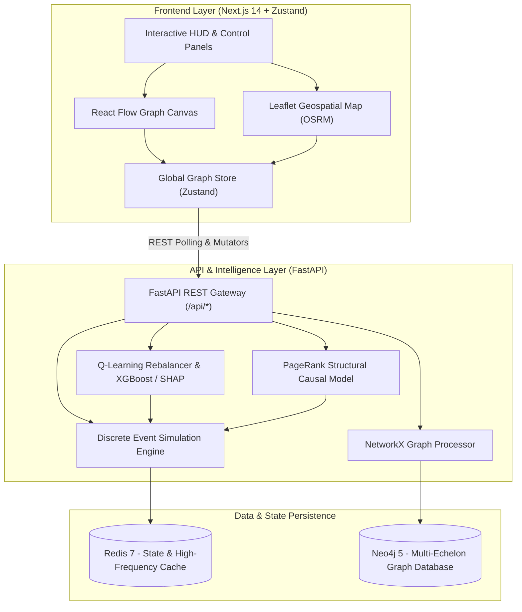

# SCARLET
## Supply Chain Analysis with Reasoning, Learning and Explainable Twin

[](https://fastapi.tiangolo.com/)
[](https://nextjs.org/)
[](https://reactflow.dev/)
[](https://leafletjs.com/)
[](https://neo4j.com/)
[](https://redis.io/)
[](https://python.org)
[](https://www.typescriptlang.org/)
[](https://xgboost.readthedocs.io/)
[](https://shap.readthedocs.io/)

A **Supply Chain Digital Twin Platform** designed to model complex multi-echelon supply networks as dynamic interactive graphs, simulate multi-type disruption cascades, compute causal blast radii using graph centrality algorithms, optimize inventory and routing via online reinforcement learning (Q-Learning) and gradient boosting (XGBoost), and explain AI-driven interventions in real time with SHAP feature attributions.

---

## 🏗️ System Architecture



---

## ✨ Key Capabilities & Features

### 1. 🌐 Dynamic Multi-Echelon Graph Modeling
- **Echelons & Node Roles**: `Supplier`, `Factory`, `Warehouse`, `Port`, `TransportHub`, and `Customer`.
- **Node Attributes**: `capacity`, `inventory`, `risk_score`, `processing_time`, `lat`, `lng`.
- **Edge Attributes**: `transit_time`, `cost`, `congestion`, `disruption_probability`.
- **Persistence & Traversal**: **Neo4j** graph database backend with high-performance `UNWIND` batch transactions for instant graph ingestion, plus in-memory **NetworkX** graph snapshot execution.

### 2. ⚡ Discrete Event Simulation & Multi-Type Shock Injection
- Time-stepped discrete simulation ticks modeling live demand drawdowns, factory replenishment, and multi-hop failure propagation.
- **4 Structured Disruption Types**:
  - `node_failures`: Collapses node inventory to 0, spikes risk, and initiates PageRank-based causal wave shock propagation.
  - `edge_disruptions`: Increases route congestion and compounds downstream receiving risk.
  - `demand_spikes`: Multiplies downstream consumption drawdowns, stressing upstream supply tiers.
  - `capacity_reductions`: Shrinks maximum storage capacity and forces discard/spoilage of overflow inventory.
- Real-time in-memory state streamed to **Redis** and synchronized to the UI via high-frequency telemetry polling.

### 3. 🎯 Structural Causal Reasoning & Blast Radius Tracing
- **Graph Centrality Propagation**: Computes failure waves across the network using weighted **PageRank centrality** to identify critical structural bottleneck hubs that amplify disruption shocks.
- **Lineage Tracing & Visual Blast Radius**:
  - Interactive BFS graph traversal identifying all upstream supplier dependencies (highlighted in Amber).
  - Downstream blast radius tracing showing all dependent nodes structurally exposed to failure (highlighted in Cyan).
  - Identification of critical risk-contributing nodes exceeding severity thresholds.

### 4. 🤖 AI Optimization: Q-Learning Rebalancer & XGBoost Rerouter
- **Tabular Q-Learning Inventory Rebalancing**:
  - Discretizes continuous node metrics into a 9-state tuple $(inv\_state, risk\_state)$ representing operational inventory bands and risk levels.
  - 3 Dynamic Action Policies: `STABLE` (nominal state), `REBALANCE` (transfers buffer stock from surplus warehouses to stockout-threatened nodes), and `REROUTE` (alleviates congested inbound links).
  - Dynamic Bellman update reward function balancing inventory health, stockout catastrophe penalties, and risk mitigation, persisted to disk (`q_table.json`).
- **XGBoost Delay Prediction**:
  - Gradient-boosted regressor predicting transit delay from route distance, duration, congestion, demand, and graph centrality metrics.
- **SHAP Feature Explainability**:
  - Dynamic tree feature attribution (`shap.TreeExplainer`) explaining *why* the AI predicted delays or recommended specific rerouting interventions.
  - Multi-route disruption simulation (`POST /api/routing/simulate`) evaluating candidate paths under traffic spikes and demand surges.

### 5. 🖥️ Interactive Dual-Canvas UI (React Flow & Leaflet)
- **React Flow Canvas**:
  - Automated hierarchical graph layout powered by **Dagre**.
  - Custom telemetry node pills displaying real-time Risk, Capacity, and Inventory levels.
  - Animated bezier flow edges with directional markers that reflect link health and throughput.
  - Dynamic dependency highlighting on selection (Upstream vs. Blast Radius).
- **Geographic Map Canvas**:
  - Interactive **Leaflet** map with real-world road network routing via **OSRM**.
  - Multi-alternative route rendering with ML delay scoring and optimal route highlighting (Emerald).
  - In-map disruption trigger panel (`Traffic Spike`, `Demand Surge`).
- **HUD Glassmorphism Control Panels**:
  - `SimulationPanel`: Multi-tab interface for simulation parameters (timesteps, tick delay), Manual vs. AI decision mode toggle, disruption shock injector, and live AI action log stream.
  - `MetricsPanel`: Real-time floating telemetry displaying Global Inventory, Active Disruptions, and System-Weighted Risk Index.
  - `ExplainabilityPanel`: Floating cursor-following and selection drawer displaying causal explanations, SHAP feature impact bars, and critical risk contributors.

---

## 🛠️ Tech Stack

### Frontend
- **Framework**: Next.js 14 (App Router, React 18)
- **Language**: TypeScript (Strict Mode)
- **State Management**: Zustand
- **Visualizations**: React Flow 11, Leaflet / React-Leaflet, Dagre
- **Styling & Motion**: TailwindCSS, Framer Motion, Lucide React

### Backend
- **Framework**: FastAPI (Async / ASGI)
- **Language**: Python 3.11+
- **Graph Processing**: NetworkX, Neo4j Python Async Driver
- **Machine Learning & Explainability**: XGBoost, SHAP, Scikit-learn, NumPy, Pandas
- **In-Memory State & Cache**: Redis 7
- **Validation**: Pydantic v2 & Pydantic Settings

### Infrastructure
- **Graph Database**: Neo4j 5
- **Cache & Bus**: Redis 7
- **Containerization**: Docker & Docker Compose

---

## 📁 Repository Structure

```text
.
├── backend/
│   ├── app/
│   │   ├── main.py                  # FastAPI application entry point & lifespan management
│   │   ├── api/                     # REST API Route Handlers
│   │   │   ├── graph.py             # Node & Edge CRUD, UNWIND batch import
│   │   │   ├── simulation.py        # Discrete event simulation start, status, metrics
│   │   │   ├── routing.py           # XGBoost delay prediction & route simulation
│   │   │   ├── dev.py               # Development graph seed & wipe endpoints
│   │   │   └── health.py            # Multi-DB health verification
│   │   ├── core/                    # Application settings & logging configuration
│   │   ├── db/                      # Neo4j, Redis, and PostgreSQL client connections
│   │   ├── models/                  # Base ORM definitions
│   │   ├── schemas/                 # Pydantic request/response validation models
│   │   ├── services/                # Business logic, ML models, & simulation loop
│   │   │   ├── graph_service.py     # Neo4j Cypher query execution
│   │   │   ├── simulation_service.py# In-memory discrete-event simulation loop
│   │   │   ├── ml_optimization_service.py # Tabular Q-Learning rebalancing agent
│   │   │   ├── ml_routing_service.py# XGBoost delay model & SHAP explainer
│   │   │   ├── ml_causal_service.py # PageRank structural causal propagation
│   │   │   ├── snapshot_service.py  # Neo4j to NetworkX in-memory graph snapshot
│   │   │   └── dev_service.py       # Realistic multi-echelon seed dataset
│   │   └── workers/                 # Background task worker definitions
│   ├── Dockerfile                   # Backend Docker container configuration
│   ├── docker-compose.yml           # Full-stack container orchestration
│   ├── requirements.txt             # Python dependencies
│   ├── q_table.json                 # Pre-trained Q-Learning policy table
│   └── routing_model.pkl            # Pre-trained XGBoost routing delay model
├── frontend/
│   ├── src/
│   │   ├── app/                     # Next.js 14 App Router layout & home view
│   │   ├── components/
│   │   │   ├── dashboard/           # SimulationPanel, MetricsPanel, ExplainabilityPanel, RoutingControlPanel
│   │   │   └── graph/               # GraphCanvas (React Flow) & MapCanvas (Leaflet)
│   │   ├── lib/                     # BFS graph reasoning & utility helpers
│   │   └── store/                   # Zustand global state store (graphStore.ts)
│   ├── package.json                 # Node dependencies & scripts
│   ├── tailwind.config.ts           # Tailwind styling configuration
│   └── tsconfig.json                # TypeScript configuration
└── README.md                        # Project documentation
```

---

## 🚀 Quickstart & Setup Guide

### Option 1: Full-Stack Docker Setup (Recommended)

Make sure you have [Docker](https://www.docker.com/) and Docker Compose installed.

1. **Clone the repository**:
   ```bash
   git clone https://github.com/echinem/SCARLET-Supply-Chain-Analysis-with-Reasoning-Learning-and-Explainable-Twin-.git
   cd SCARLET-Supply-Chain-Analysis-with-Reasoning-Learning-and-Explainable-Twin-
   ```

2. **Launch backend & database services via Docker Compose**:
   ```bash
   cd backend
   docker-compose up --build -d
   ```
   *This initializes FastAPI, Neo4j, and Redis.*

3. **Start the Frontend**:
   ```bash
   cd ../frontend
   npm install
   npm run dev
   ```

4. Open `http://localhost:3000` in your browser.

---

### Option 2: Local Development Setup

#### Backend Setup
```bash
cd backend

# Create & activate a python virtual environment
python -m venv venv
# On Windows:
venv\Scripts\activate
# On Linux/macOS:
source venv/bin/activate

# Install dependencies
pip install -r requirements.txt

# Start Redis & Neo4j via Docker
docker run -d --name twin-redis -p 6379:6379 redis:7-alpine
docker run -d --name twin-neo4j -p 7474:7474 -p 7687:7687 -e NEO4J_AUTH=neo4j/password neo4j:5

# Run FastAPI development server
uvicorn app.main:app --reload --host 0.0.0.0 --port 8000
```

#### Frontend Setup
```bash
cd frontend

# Install node dependencies
npm install

# Start Next.js dev server
npm run dev
```

Open `http://localhost:3000` in your browser. Click **"Seed Development Network"** to initialize the graph.

---

## 📡 API Endpoints Overview

All API responses follow a standardized JSON wrapper:

```json
{
  "status": "success",
  "data": { ... },
  "meta": {
    "timestamp": "2026-08-22T12:00:00Z"
  },
  "error": null
}
```

### Core API Endpoints

| Category | Method | Endpoint | Description |
|---|---|---|---|
| **Health** | `GET` | `/health` | Verifies DB connectivity (Neo4j, Redis, Postgres) |
| **Development** | `POST` | `/api/dev/seed` | Seeds database with a pre-configured multi-echelon network |
| **Development** | `DELETE` | `/api/dev/clear` | Wipes all graph nodes and relationships |
| **Graph** | `GET` | `/api/nodes` | Retrieves all active nodes with properties |
| **Graph** | `POST` | `/api/nodes` | Creates a new single node |
| **Graph** | `GET` | `/api/nodes/{id}` | Retrieves a single node by its `node_id` |
| **Graph** | `DELETE` | `/api/nodes/{id}` | Deletes a node and all connected edges |
| **Graph** | `GET` | `/api/edges` | Retrieves all relationship edges |
| **Graph** | `POST` | `/api/edges` | Creates a new relationship edge between existing nodes |
| **Graph** | `DELETE` | `/api/edges/{id}` | Deletes a relationship edge by its `edge_id` |
| **Graph** | `POST` | `/api/graph/import` | High-performance batch import using Neo4j `UNWIND` queries |
| **Simulation** | `POST` | `/api/simulate` | Starts a discrete time-step simulation run (Manual / AI mode) |
| **Simulation** | `GET` | `/api/simulation/{id}/status` | Retrieves real-time simulation status & aggregated metrics |
| **Simulation** | `GET` | `/api/simulation/{id}/metrics` | Retrieves detailed timestep metrics, node stats, and AI action logs |
| **Smart Routing** | `POST` | `/api/routing/predict-delay` | Predicts route delay with XGBoost and returns SHAP explanations |
| **Smart Routing** | `POST` | `/api/routing/simulate` | Simulates route disruptions (`traffic_spike`, `demand_surge`) across alternatives |

---

## 👥 Other Contributors

- **Shrankhala Singh** ([GitHub](https://github.com/shrankhalalala))
- **Nishtha Jain**

---

**SCARLET** — *Supply Chain Analysis with Reasoning, Learning and Explainable Twin*  
Repository: [SCARLET](https://github.com/echinem/SCARLET-Supply-Chain-Analysis-with-Reasoning-Learning-and-Explainable-Twin-.git)
